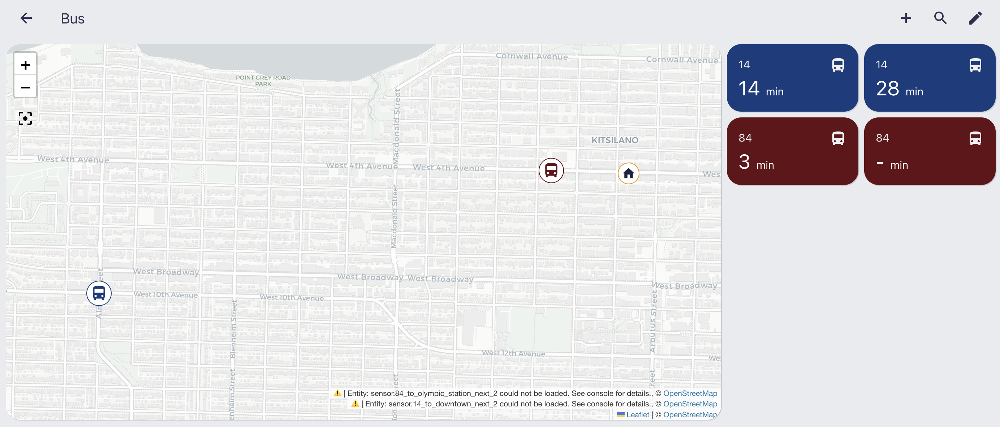

# Home Assistant GTFS Realtime

This Home Assistant integration provides real-time transit departure sensors using GTFS Realtime feeds. Create multiple sensors for different routes and stops, or multiple sensors for the same route/stop to track the next several departures.

Key features include real-time departure tracking with vehicle positions, support for multiple sensors per route/stop combination, and an optional static GTFS fallback that supplements real-time data with schedule information when live data is unavailable.

While this is not a fork, this work has been strongly inspired from the [package](https://github.com/mark1foley/ha-gtfs-rt-v2) from [@mark1foley](https://github.com/mark1foley).

## How It Works

1. **Real-time Data Collection**: The sensor first collects real-time departure information from the GTFS-RT feed
2. **Departure Count Check**: For each route/stop/direction combination, it checks if there are at least x future departures
3. **Static Fallback**: If there are fewer than x departures, it adds static departures
4. **Conflict Resolution**: Static departures are filtered out if they're within 5 minutes of an existing real-time departure
5. **Sorting**: All departures (real-time and static) are sorted by arrival time

## Installation via HACS
1. Add `https://github.com/william57m/ha-gtfs-rt-v2` as a [custom repository](https://hacs.xyz/docs/faq/custom_repositories/) as Type: Integration
2. Click install under "GTFS Realtime", then restart your instance for the installation to take effect.

## Manual Installation 
1. Download this repository as a ZIP
2. Copy `/custom_components/gtfs_rt` to your `<config_dir>/custom_components/` directory

## Configuration
Add the following to your `configuration.yaml` file:

```yaml
sensor:
 - platform: gtfs_rt
 ```

With the configuration variables:
- **trip_update_url** (*Required*): Provides route update feeds
- **vehicle_position_url** (*Optional*): Provides live position tracking
- **enable_static_fallback** (*Optional*, default: `false`): Enable the static fallback feature
- **static_gtfs_url** (*Optional*): URL to a static GTFS feed zip file
- **api_key_header** (*Optional*): This key will be included in the header, along with the api_key value.
- **api_key** (*Optional*): This key is your actual API key that will be sent in the the value api_key_header key.
- **route_delimiter** (*Optional*): If provided, the text in the feed's route id before the delimiter is used as the route id.  Useful if the provider incorporates calendar ids into their route ids.1
- **departures** (*Required*): A list of routes and departure locations to watch
  - **name** (*Required*): The name of the sensor in HA.  When displaying on the map card HA generates the name using the first letters of the first 3 words.  So, 1<space>0<space>7<space>Bus shows as "107" on the map.  Different labels can be defined when displaying the sensor on an entiry card etc.
  - **route** (*Required*): The name of the gtfs route (if route_delimiter is used, the text before the delimiter)
  - **stopid** (*Required*): The stopid for the location you want etas for
  - **directionid** (*Optional*): Supports the direction_id from the GTFS feed trips.txt file, which indicates the direction of travel.  Use when the stops are direction neutral. **Caution:** Although added to the GTFS specification thein 2015, the direction_id field is still classified as *experimental*.  So there may be variations in implementation between providers or its use may be subject to change.
  - **icon** (*Optional*): The icon used in HA for the sensor (default is mdi:bus if non supplied)
  - **service_type** (*Optional*): The name used when created the "Next <service type>" attribute for the sensor in HA.  For example, Next Bus, Next Ferry etc etc (default is "Next Service" if non supplied)

## Screenshot



## Troubleshooting

A `test.py` script is provided for easier troubleshooting outside of Home Assistant. The script uses the same YAML configuration format as Home Assistant and can test different GTFS-RT providers, routes, and stop configurations in any Python 3 environment (see `test_translink.yaml` for an example).

Usage:
```
test.py -f <yaml file> -d INFO|DEBUG { -l <outfile log file> }
```

